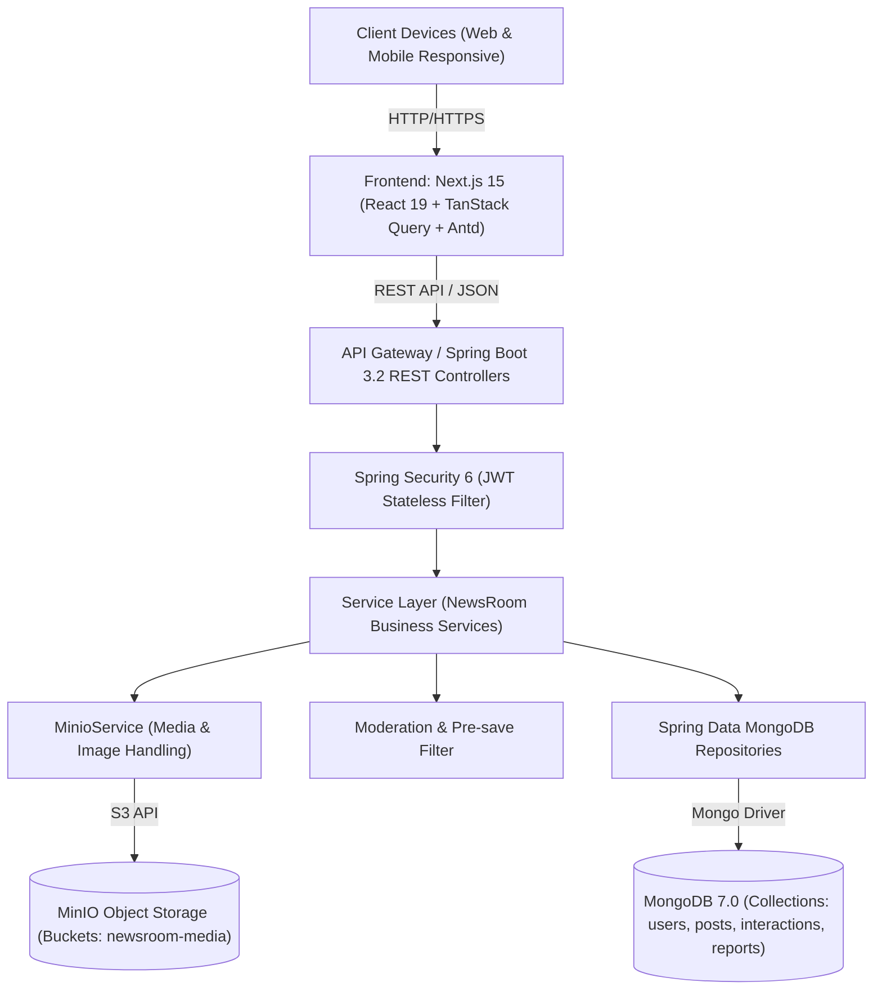

# Architecture Spine — NewsRoom

> Architecture consistency contract for the NewsRoom platform.
> Source of truth for backend (Spring Boot 3.2), frontend (Next.js 15), data models (MongoDB 7.0), and object storage (MinIO).



## Design Paradigm

Hệ thống áp dụng **Layered Architecture with Clean Domain Boundaries** (Kiến trúc phân tầng với ranh giới nghiệp vụ độc lập):
1. **Presentation Layer (`com.newsroom.controller`)**: Tiếp nhận HTTP requests, parse DTO đầu vào với `@Valid`, gọi Service tương ứng, bọc dữ liệu trả về trong chuẩn `ApiResponse<T>`. Tuyệt đối không chứa logic tính toán nghiệp vụ hay truy vấn database trực tiếp.
2. **Security Layer (`com.newsroom.security`)**: Intercept requests qua `JwtAuthenticationFilter`, kiểm tra Bearer token, trích xuất `UserPrincipal` (ID, Email, Roles), nạp vào `SecurityContextHolder`.
3. **Application & Domain Service Layer (`com.newsroom.service` & `implement`)**: Trung tâm xử lý nghiệp vụ: kiểm duyệt từ khóa, tính toán atomic counters, lọc tin tức, phân quyền tác giả.
4. **Storage & Infrastructure Layer (`com.newsroom.service.MinioService`)**: Xử lý upload/download file ảnh với MinIO Object Storage, sinh Presigned URLs cho client.
5. **Persistence Layer (`com.newsroom.repository`)**: Sử dụng Spring Data MongoRepository để giao tiếp với MongoDB 7.0.

---

## Invariants & Rules

### AD-1 — Strict Layered Dependency Direction
- **Binds:** Toàn bộ Backend controllers, services, repositories.
- **Prevents:** Tình trạng Controller gọi thẳng Repository bỏ qua kiểm duyệt/auth, hoặc Service phụ thuộc vòng tròn (circular dependency).
- **Rule:** Chiều phụ thuộc bắt buộc là một chiều: `Controller -> Service -> Repository`. Controller không bao giờ được inject `*Repository`. Việc chuyển đổi giữa Entity Model và DTO bắt buộc sử dụng MapStruct mappers (`com.newsroom.mapper`).

### AD-2 — Social Feed Query Strategy: Fan-out on Read
- **Binds:** FR-4, FR-5, FR-6 (Feed cá nhân, Feed công khai, Tab Nhà báo).
- **Prevents:** Nghẽn tài nguyên ghi và bùng nổ lưu trữ (Write amplification) khi user đăng bài có nhiều followers.
- **Rule:** Hệ thống sử dụng cơ chế **Fan-out on Read** (truy vấn tổng hợp tại thời điểm đọc):
  - Khi user truy vấn Tab "Đang theo dõi": backend lấy mảng `followingIds` của user đó từ collection `follows`, sau đó query MongoDB:
    `db.posts.find({ authorId: { $in: followingIds }, status: "PUBLISHED" }).sort({ createdAt: -1 }).limit(pageSize)`
  - Khi user truy vấn Tab "Nhà báo": query với `{ authorRole: "JOURNALIST", status: "PUBLISHED" }`.
  - **Index bắt buộc:** `{ authorId: 1, status: 1, createdAt: -1 }` và `{ authorRole: 1, status: 1, createdAt: -1 }`.

### AD-3 — Media Storage via MinIO Object Storage [ADOPTED]
- **Binds:** FR-7 (Đính kèm ảnh bài viết), FR-3 (Avatar người dùng).
- **Prevents:** Lưu file rải rác trên local server khiến ứng dụng không thể scale ngang nhiều container; backend phải gánh luồng tải ảnh nặng.
- **Rule:** Toàn bộ file ảnh được đẩy lên bucket `newsroom` của **MinIO** thông qua `MinioService`. Database chỉ lưu URL / key tham chiếu dạng string. Client hiển thị ảnh qua URL CDN / MinIO endpoint trực tiếp.

### AD-4 — Content Moderation & Auto-scan Pre-save Filter
- **Binds:** FR-14 (Auto-scan vi phạm), FR-15 (Báo cáo vi phạm), FR-16 (Kiểm duyệt Admin).
- **Prevents:** Bài viết chứa nội dung bạo lực, xúc phạm hoặc tin đồn độc hại xuất hiện trên dòng tin công cộng.
- **Rule:** 
  1. Khi người dùng submit bài viết (`POST /api/posts`), `PostService` thực thi kiểm tra từ khóa nhạy cảm (Keyword Trie / Regex Filter) **đồng bộ trước khi lưu**:
     - Nếu không chứa từ cấm: `status = "PUBLISHED"`.
     - Nếu phát hiện từ cấm: `status = "FLAGGED_PENDING_REVIEW"`. Bài viết không xuất hiện trên Public Feed, chỉ tác giả nhìn thấy kèm nhãn "Đang kiểm duyệt".
  2. Khi một bài viết đạt ngưỡng báo cáo `reportsCount >= 3` từ 3 người dùng khác nhau: bài viết tự động chuyển trạng thái `status = "FLAGGED"` và đưa vào hàng đợi kiểm duyệt của Admin.

### AD-5 — Interaction Counters: Denormalized Atomic Increments
- **Binds:** FR-8 (Like), FR-9 (Comment), FR-10 (Share).
- **Prevents:** Truy vấn aggregate đếm triệu dòng làm chậm thời gian tải Feed từ vài chục ms lên hàng giây.
- **Rule:** 
  - Chi tiết quan hệ lưu trong collection `interactions`: `{ userId, postId, type: "LIKE"|"SHARE", createdAt }` với **Unique Compound Index** `{ userId: 1, postId: 1, type: 1 }`.
  - Document `Post` lưu sẵn các trường đếm gộp: `likeCount`, `commentCount`, `shareCount`. Khi user click Like/Unlike, backend thực hiện atomic update trên MongoDB:
    `mongoTemplate.updateFirst(query, new Update().inc("likeCount", 1), Post.class)`. Đọc Feed đạt độ phức tạp O(1) cho các chỉ số tương tác.

### AD-6 — Authentication & Role-Based Access Control (RBAC)
- **Binds:** FR-1, FR-2, FR-20, FR-21.
- **Prevents:** Lộ dữ liệu quản trị hoặc giả mạo vai trò nhà báo.
- **Rule:**
  - Token JWT chứa claims: `sub` (userId), `email`, `roles` (`ROLE_USER`, `ROLE_JOURNALIST`, `ROLE_ADMIN`).
  - Phân quyền endpoint:
    - `GET /api/posts/**` (Public Feed): Cho phép truy cập không cần token (Guest).
    - `POST /api/posts/**`, `/api/interactions/**`: Yêu cầu tối thiểu `ROLE_USER`.
    - `/api/admin/**`: Yêu cầu bắt buộc `ROLE_ADMIN`.
  - Quyền gắn badge Nhà báo: Chỉ có `ROLE_ADMIN` mới được cập nhật trường `isJournalist = true` trong user profile.

### AD-7 — In-Feed Advertisement Delivery
- **Binds:** FR-17, FR-18, FR-19 (Quảng cáo V1).
- **Prevents:** Quảng cáo làm vỡ cấu trúc danh sách bài viết hoặc gây gián đoạn layout mobile.
- **Rule:** Vị trí in-feed ads được trả về cùng payload của feed hoặc inject ở tầng client theo tỷ lệ cố định (1 banner sau mỗi 6 bài viết). Mỗi khi hiển thị, client gọi ngầm `POST /api/ads/{id}/impression` để ghi nhận số liệu.

---

## Consistency Conventions

| Lĩnh vực | Quy chuẩn kỹ thuật (Convention) |
|---|---|
| **Naming Backend** | Class: `PostController`, `PostService`, `PostServiceImplement`, `PostRepository`, `PostDocument`, `PostDTO`. Collection: chữ thường số nhiều (`posts`, `users`, `interactions`, `comments`, `reports`, `advertisements`). |
| **Naming Frontend** | Thư mục trang: `src/app/(feed)/page.tsx`, component: PascalCase (`PostCard.tsx`, `Composer.tsx`), custom hooks: `useFeedQuery.ts`, `useLikeMutation.ts`. |
| **API Envelope** | Mọi API response đều bọc trong cấu trúc chuẩn: `{ "code": 200, "message": "Success", "data": { ... } }` hoặc error `{ "code": 400, "message": "Validation Failed", "errors": [ ... ] }`. |
| **ID & Timestamps** | Khóa chính MongoDB là chuỗi Hex 24 ký tự (`String id`). Toàn bộ timestamp lưu dạng ISO-8601 UTC (`Instant createdAt`, `Instant updatedAt`). |
| **State Management** | Frontend sử dụng TanStack React Query làm nguồn chân lý cho server state; không dùng Redux cồng kềnh cho feed data. |

---

## Stack

| Công nghệ | Phiên bản | Vai trò trong hệ thống |
|---|---|---|
| **Java** | 21 LTS | Ngôn ngữ backend chính |
| **Spring Boot** | 3.2.0 | Framework nền tảng backend API |
| **Spring Data MongoDB** | 4.2 | ORM / OGM kết nối MongoDB |
| **MongoDB** | 7.0 | Cơ sở dữ liệu NoSQL chính |
| **MinIO** | io.minio:8.5.7 | Lưu trữ Media & Hình ảnh (S3-compatible) |
| **Spring Security** | 6.2 | Bảo mật & Xác thực RBAC |
| **JJWT** | 0.12.3 | Tạo và kiểm tra JWT Access Token |
| **MapStruct** | 1.6.3 | Ánh xạ DTO <-> Entity hiệu năng cao |
| **Next.js** | 15.5 | Frontend Framework (App Router + Server Components) |
| **React** | 19.2 | UI Library |
| **Ant Design** | 5.27 | Bộ linh kiện giao diện cơ sở |
| **Tailwind CSS** | 3.3 | Thiết kế kiểu dáng & Design Tokens |
| **TanStack React Query** | 5.90 | Quản lý dữ liệu bất đồng bộ & Cache phía Client |

---

## Structural Seed

### Backend Package Structure (`backend/src/main/java/com/newsroom`)
```text
com.newsroom
├── config/               # SecurityConfig, MongoConfig, MinioConfig, WebMvcConfig
├── controller/           # PostController, AuthController, UserController, AdController, AdminController
├── service/              # PostService, UserService, MinioService, AdService, ReportService
│   └── implement/        # PostServiceImplement, MinioServiceImplement, ...
├── repository/           # PostRepository, UserRepository, InteractionRepository, ...
├── model/                # Post.java, User.java, Interaction.java, Comment.java, Report.java
├── dto/                  # Request & Response payload objects
├── mapper/               # MapStruct mapper interfaces
├── enums/                # PostStatus, Role, InteractionType, ReportReason
├── security/             # JwtTokenProvider, JwtAuthenticationFilter, UserPrincipal
└── commons/              # ApiResponse, GlobalExceptionHandler, Constants
```

### MongoDB Collections Schema Seed

```typescript
// Collection: users
interface User {
  _id: string; // ObjectId Hex
  email: string; // unique index
  passwordHash: string;
  displayName: string;
  avatarUrl?: string;
  bio?: string;
  role: "USER" | "JOURNALIST" | "ADMIN";
  isJournalistVerified: boolean;
  journalistOrganization?: string; // e.g. "TTXVN", "VnExpress"
  followersCount: number;
  followingCount: number;
  status: "ACTIVE" | "LOCKED";
  createdAt: Instant;
}

// Collection: posts
interface Post {
  _id: string;
  authorId: string; // indexed
  authorName: string;
  authorAvatar?: string;
  authorRole: "USER" | "JOURNALIST";
  title?: string;
  content: string;
  imageUrls: string[]; // MinIO presigned or public paths
  category: "THOI_SU" | "GIAO_THONG" | "CONG_NGHE" | "DOI_SONG";
  tags: string[]; // e.g. ["#NgaTuSo", "#HaNoi"]
  visibility: "PUBLIC" | "FOLLOWERS_ONLY";
  status: "PUBLISHED" | "FLAGGED_PENDING_REVIEW" | "DELETED";
  likeCount: number;
  commentCount: number;
  shareCount: number;
  reportsCount: number;
  createdAt: Instant; // indexed
}

// Collection: interactions
interface Interaction {
  _id: string;
  userId: string;
  postId: string;
  type: "LIKE" | "SHARE";
  createdAt: Instant;
  // Unique Compound Index: { userId: 1, postId: 1, type: 1 }
}

// Collection: follows
interface Follow {
  _id: string;
  followerId: string; // Người theo dõi
  followingId: string; // Người được theo dõi
  createdAt: Instant;
  // Unique Compound Index: { followerId: 1, followingId: 1 }
}

// Collection: reports
interface Report {
  _id: string;
  reporterId: string;
  postId: string;
  reason: "FAKE_NEWS" | "OFFENSIVE" | "SPAM" | "COPYRIGHT";
  description?: string;
  status: "PENDING" | "RESOLVED" | "DISMISSED";
  createdAt: Instant;
}
```

---

## Deferred (Hoãn lại cho các phiên bản tiếp theo)

1. **WebSockets / SSE cho Live Push Notifications:** Ở giai đoạn V1, client sử dụng cơ chế polling nhẹ (30s) bằng React Query để cập nhật thông báo mới. WebSockets sẽ được triển khai ở V2 khi người dùng tương tác đồng thời tăng cao.
2. **Công cụ Tìm kiếm Chuyên sâu (Elasticsearch / MongoDB Atlas Search):** Giai đoạn V1 sử dụng MongoDB Regex và Index theo Tag/Category. Khi số lượng bài vượt 500.000 bài viết sẽ bổ sung Elasticsearch.
3. **Cổng nạp tiền tự động cho Nhà quảng cáo (Self-service Ads Portal):** V1 toàn bộ chiến dịch quảng cáo do Admin nhập liệu và quản lý trong Admin Panel.
